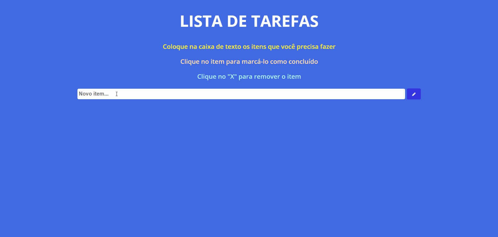

# ✔️ Project
A to do list that you can use to put the things that you need to do and when you complete the things you can click in the item to indicate the thing is done, you have the X to remove the item whenever you want.

## Interface 
<h1 align="center">
    
</h1>

# 💻 Technologies
## Front End
- **HTML**
- **CSS**
- **JS**
## Back End
- **JS**

# 📝 License
This project have the license of the [MIT](./LICENSE).